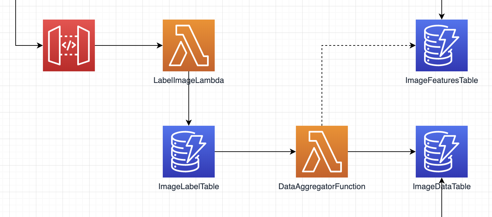

# mood-music-lambda-backend

Backend for the labeling system of the mood-music application

* set your aws profile: `export AWS_PROFILE=nxtradev`
* deploy: `sls deploy -v`
* delete stack: `sls remove`

## Architecture

